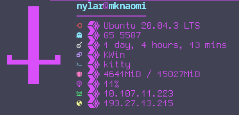
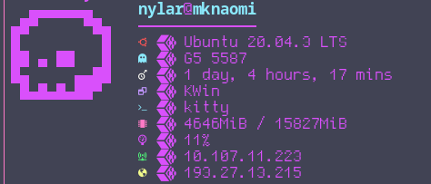
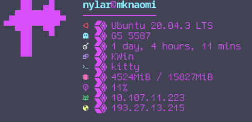
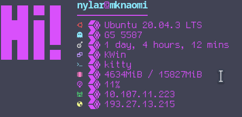
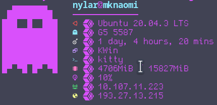

#Neofetch_Custom -- modified config scripts for neofetch -- this is a mini conf
#below are options available for display, I'm using some custom ascii art 
#included the custom ascii art in the repo under ascii_art 
# By -- 𝗇𝗒𝗅𝖺𝗋𝟥𝟧𝟩𝘓5↋ɹɐʅʎu --  2022 Feb -- github.com/nylar357/neofetch_custom.git 

### Some great ascii art put together that all work great for neofetch

## Wall

## Sword

## Skull

## Haxe

## Hi!

## Ghost

