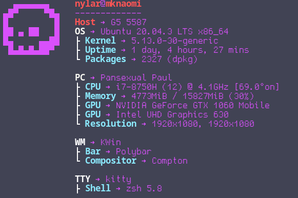
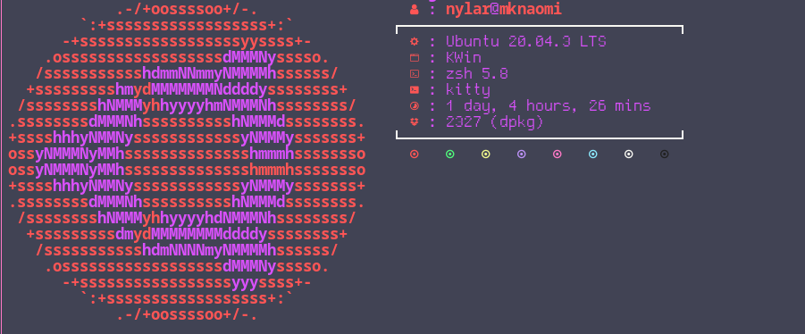
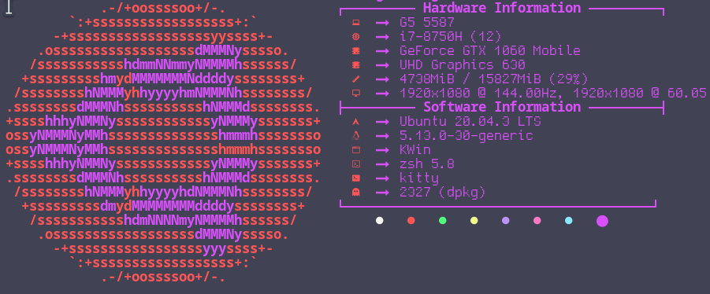
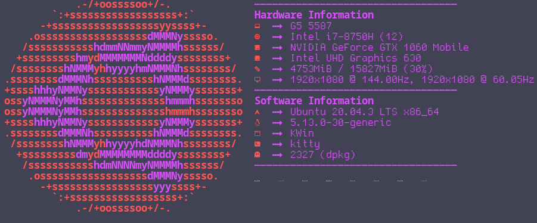

##### Neofetch_Custom -- modified config scripts for neofetch
### Conf contains the custom neofetch configs
### Ascii contains the custom ascii art

##### USAGE 

``` neofetch --config <path/to/config.conf --ascii path/to/ascii/art.txt ```


# Custom Neofetch Configs

-TallJoe-



-Idlifetch-



-Config-



-Config2-




### Some great ascii art put together that all work great for neofetch

-Wall-


-Sword-


-Skull-


-Haxe-


-Hi!-


-Ghost-


